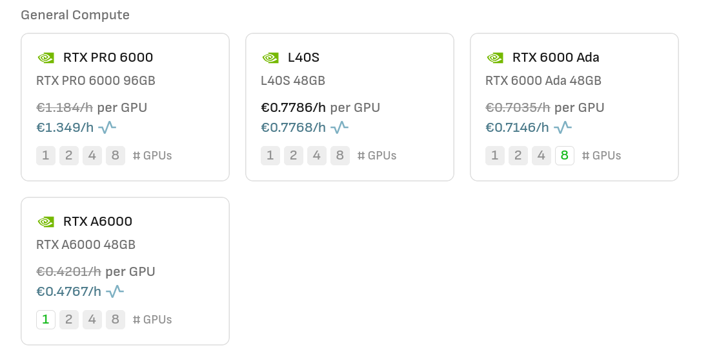
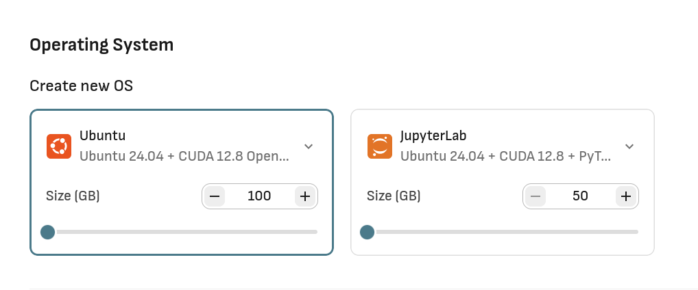
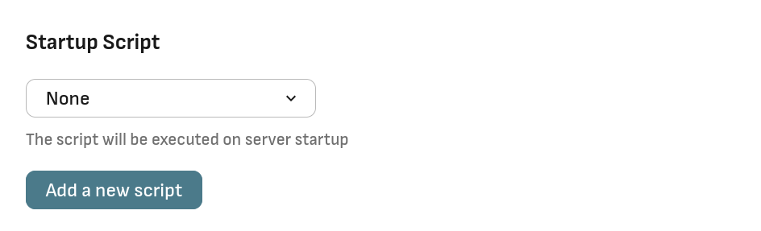

# Robot Learning Playground Environment for Aaltoes Robotics 2025

Robot learning playground environment based on [MuJoCo Playground](https://github.com/google-deepmind/mujoco_playground). Support for Isaac Sim -based [Robot Lab](https://github.com/fan-ziqi/robot_lab) is planned for the future.

## Setup Data Crunch Instance

### 1. Create an Ubuntu instance with Docker (without JupyterLab)

Make sure to select a GPU instance.



Use an OS image provided by Data Crunch which has Ubuntu and Docker installed. **DO NOT select one with preinstalled JupyterLab since it will conflict with our JupyterLab later.**



### 2. Configure a [Startup Script](scripts/startup.sh) during instance creation

Create a new startup script with the following content: [startup.sh](scripts/startup.sh). This script will install the necessary dependencies and start the container. You can also use the [Run Docker](scripts/run-docker.sh) script to start the container manually. But be sure to have the NVIDIA Container Toolkit installed as shown in the [Install NVIDIA Container Toolkit](scripts/install-nvidia-ctk.sh) script.



### 3. SSH to the instance with port forwarding

```bash
ssh -L 8888:localhost:8888 root@INSTANCE_IP
```

You will get an interactive shell to the instance, but you do not have to do anything there. You can, however, check if the container is running by running `sudo docker ps`. Data Crunch has docs on managing SSH keys [here](https://docs.datacrunch.io/cpu-and-gpu-instances/creating-an-ssh-key).

### 4. Open http://localhost:8888 in your browser

Open http://localhost:8888 in your browser. You will be redirected to the JupyterLab login page. Enter the token: `aaltoes-robotics-2025` to login.

### 5. Start the notebook

You can start the notebook by clicking on the `mujoco_intro.ipynb` file in the left sidebar. The jupyter lab is using a virtual environment kernel at `/opt/venv`. The root Python is also available in the terminal. The container comes with [UV Package Manager](https://docs.astral.sh/uv/) pre-installed.

Your workspace is a Docker volume mounted at `/mujoco-playground` on the host instance (you can access it by running `ls /mujoco-playground` in your ssh session created at step 3). However, the JupyterLab virtual environment and the overall container is not persistent. If you restart the container, you will lose your installed packages and libraries, including container OS configuration.
